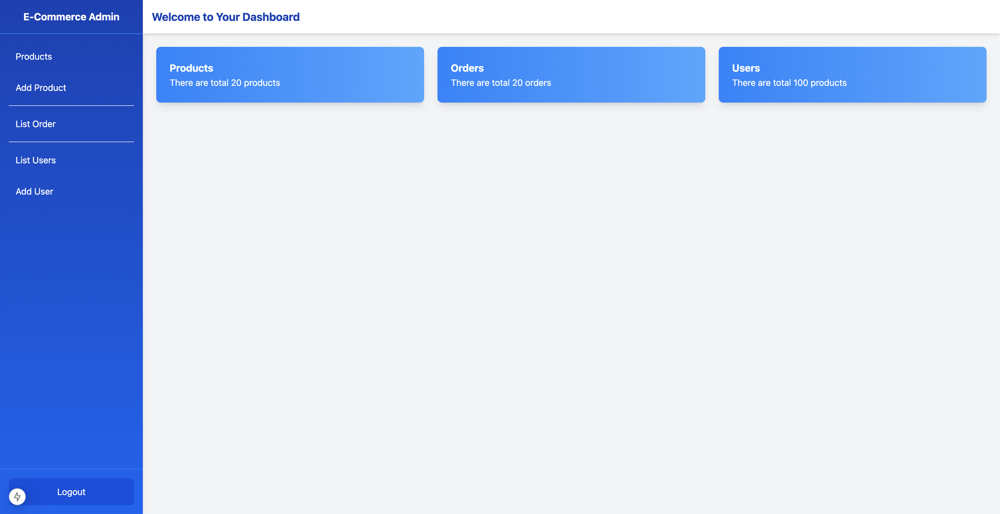

# E-Commerce Admin Dashboard

This is a Next.js-based Admin Dashboard for managing an e-commerce platform. It includes features such as adding products, listing products, managing orders, and user administration. The UI is styled with Tailwind CSS for a modern and responsive design.

## Screenshot


## Features

- **Product Management**
  - Add new products
  - List all products
- **Order Management**
  - View and manage orders
- **User Management**
  - Add new users
  - List all users

## Tech Stack

- **Framework**: [Next.js](https://nextjs.org/) (React-based framework for production-grade apps)
- **Styling**: [Tailwind CSS](https://tailwindcss.com/) (Utility-first CSS framework)

## Getting Started

Follow these steps to set up the project locally:

### Prerequisites

Ensure you have the following installed on your machine:

- [Node.js](https://nodejs.org/) (v14 or higher)
- [npm](https://www.npmjs.com/) or [yarn](https://yarnpkg.com/)

### Installation

1. Clone the repository:

   ```bash
   git clone https://github.com/yourusername/ecommerce-admin-dashboard.git
   cd ecommerce-admin-dashboard
   ```

2. Install dependencies:

   ```bash
   npm install
   # or
   yarn install
   ```

3. Run the development server:

   ```bash
   npm run dev
   # or
   yarn dev
   ```

4. Open your browser and navigate to:

   ```
   http://localhost:3000
   ```

## Project Structure

```plaintext
|-- public/       # Static assets
|-- src/          # Source code
    |-- components/ # Reusable components
    |-- pages/      # Next.js pages
    |-- styles/     # Tailwind CSS configurations
    |-- utils/      # Utility functions
|-- tailwind.config.js  # Tailwind CSS configuration
|-- next.config.js      # Next.js configuration
```

## Scripts

Here are some useful scripts for development and production:

- **`npm run dev`**: Start the development server
- **`npm run build`**: Build the project for production
- **`npm start`**: Run the production build
- **`npm run lint`**: Run linting checks

## Deployment

To deploy the application, you can use platforms like [Vercel](https://vercel.com/) or [Netlify](https://www.netlify.com/). Follow the platform-specific instructions for deployment.

## Contributing

Contributions are welcome! If you'd like to contribute, please fork the repository and make changes as you'd like. Pull requests are warmly welcomed.

## License

This project is licensed under the [MIT License](LICENSE).

## Contact

If you have any questions or suggestions, feel free to reach out:
- Email: parshavshah1995@gmail.com
